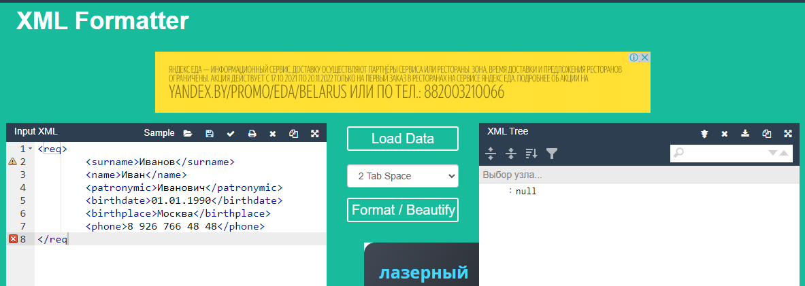
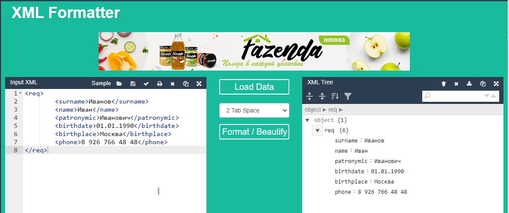
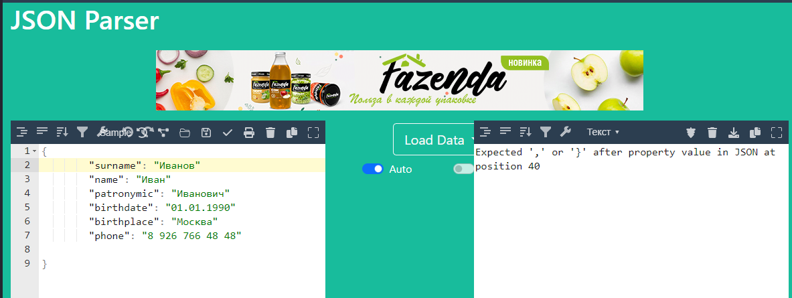
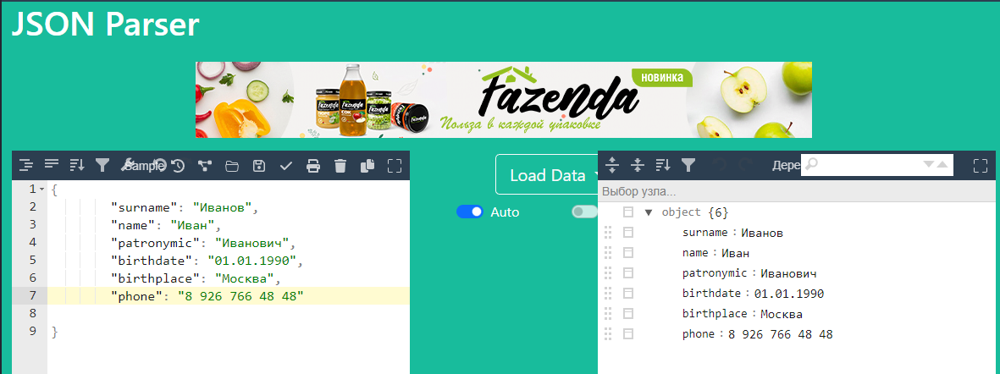

# JSON и XML


## Задача №1

проверить XML на Well formed:

```xml
<req>
    <surname>Иванов</surname>
    <name>Иван</name>
    <patronymic>Иванович</patronymic>
    <birthdate>01.01.1990</birthdate>
    <birthplace>Москва</birthplace>
    <phone>8 926 766 48 48</phone>
</req
```
Проверка XML показывает наличие ошибок, в данном случае неверно записан закрывающий тег **</req**



внесем изменения и сделаем синтаксически верную запись:



---

## Задача №2

Проверить JSON на Well formed:

```json
{
    "surname": "Иванов"
    "name": "Иван"
    "patronymic": "Иванович"
    "birthdate": "01.01.1990"
    "birthplace": "Москва"
    "phone": "8 926 766 48 48"
}
```
При проверке получаем ошибки в представленной записи, в ней не проставлены разделители - **знаки запятой**:



Внесем необходимые правки в запись:



---
